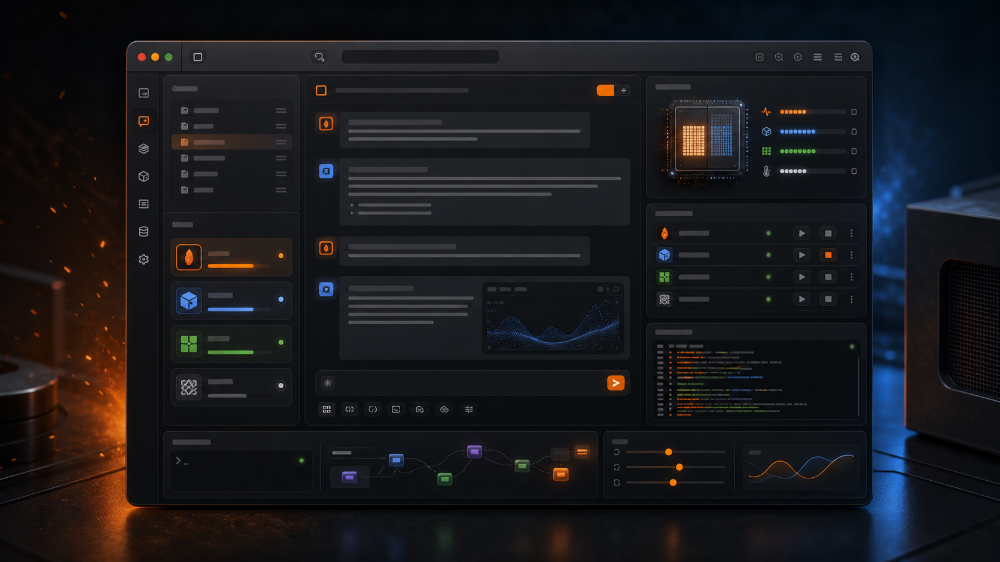

# Forge

**A native macOS workbench for local Apple Silicon models, adjustable reasoning, visual agent graphs, and an OpenAI-compatible API.**

[](https://github.com/christopherbattlefrontlegal/swift-mlx-forge/releases/tag/v2.0.1)
[](https://github.com/christopherbattlefrontlegal/swift-mlx-forge/actions/workflows/ci.yml)
[](LICENSE)
[](https://christopherbattlefrontlegal.github.io/swift-mlx-forge/)

[See what’s new in Forge 2.0.1](https://github.com/christopherbattlefrontlegal/swift-mlx-forge/releases/tag/v2.0.1) · [Visit the website](https://christopherbattlefrontlegal.github.io/swift-mlx-forge/) · [Join the discussion](https://github.com/christopherbattlefrontlegal/swift-mlx-forge/discussions)



Forge is a native macOS workbench for running local language models on Apple Silicon. Its single `mlx-forge` app combines a SwiftUI chat interface and a visual graph workbench with two in-process inference paths:

- MLX models through `mlx-swift-lm`, including supported local vision-language models.
- Compatible GGUF models through the vendored `LLM.swift`/llama.cpp backend.

Forge does not include model weights. Add folders you already own, or download MLX models from the in-app Hugging Face browser.

## Project status

- Public repository: <https://github.com/christopherbattlefrontlegal/swift-mlx-forge>
- License: MIT
- Current distribution: source install
- Public notarized binary: not available yet

The local installer creates an ad-hoc-signed app for the Mac that built it. A binary intended for other Macs still requires Developer ID signing and Apple notarization.

## Forge 2.0 highlights

- Customized **Forge Graph**, built from the MIT-licensed Rivet canvas and wired to Forge's loopback OpenAI-compatible endpoint.
- First-class **Inkling Small** support, including MXFP4/NVFP4 checkpoints, `tiktoken` tokenizers, the checkpoint's Jinja chat template, and its adjustable reasoning-effort scale.
- Updated Qwen support, including Qwen 3.5/3.6 model families and multi-token prediction paths.
- Explicit system-prompt editing: drafts are visibly Saved or Unsaved, and deleting a prompt can be deliberately saved as the model default.
- A cleaner macOS 27 toolbar and glass treatment using native SwiftUI structure.

## What the Forge app provides

- Recursive, bounded discovery of MLX model directories and loose `.gguf` files in folders you explicitly add.
- Explicit load, activate, unload, unload-all, and stop controls, with up to six reserved resident model slots.
- Local MLX chat, supported MLX VLM image input, and a text-only GGUF chat path.
- An agent graph workbench: drag blocks onto a canvas, wire one model's output into another's input, and watch the work move through the graph as it runs.
- A Forge-themed Rivet canvas with local project storage and a one-click Chat/Graph workbench switch.
- Graph blocks for a task input, a model agent, a text template, a yes/no fork, text extraction, an MCP tool call, a workspace file read or write, and a collected result.
- Any block may run a loaded local model, Anthropic, OpenAI, or OpenRouter, so a single graph can mix local and cloud models.
- Per-block tool grants and a per-graph scoped folder, so only the blocks you choose can read or write files.
- Starting shapes for a single agent, a code loop, a debate with a judge, a supervisor with workers, and an all-to-all round table.
- Selected-model local fan-out for asking several loaded models the same thing at once.
- Sampling, reasoning, thinking-budget, KV-cache, weight-loading, and system-prompt controls.
- Saved system-prompt presets, prompt-library folders, and an optional Smart Select workflow.
- Optional Anthropic, OpenAI, OpenRouter, Brave Search, and Hugging Face credentials stored in macOS Keychain.
- MCP tools with explicit server trust, per-tool selection, and a bounded tool-follow-up loop.
- A local OpenAI-compatible HTTP subset for tools that need to call a loaded model.
- A command composer for reviewing and copying Claude Code headless commands. Forge does not execute those generated commands.

## Requirements

- Apple Silicon Mac.
- macOS 26 or newer.
- Swift 6.2 or newer through Xcode or the Xcode command-line tools.
- Network access during the first SwiftPM dependency resolution.
- Your own MLX or compatible GGUF model files.
- Node.js when the embedded Forge Graph or design-prompt web bundles need to be rebuilt.
- Python 3 only for optional Smart Select searches against an external `awesome-prompts`-style `prompt_database` containing `search.py` and `get.py`.

## Install the app

```sh
git clone https://github.com/christopherbattlefrontlegal/swift-mlx-forge.git
cd swift-mlx-forge
./scripts/install-forge-app.sh
```

The installer:

1. checks the local toolchain and packaging security rules;
2. builds the release `mlx-forge` product and MLX Metal library;
3. packages Forge Graph, the design-prompt bundle, and llama.cpp framework;
4. ad-hoc signs the complete bundle;
5. installs `/Applications/Forge.app`; and
6. opens it unless `--no-open` is supplied.

Build a local bundle without installing it:

```sh
./scripts/build-app.sh
open ./Forge.app
```

See [INSTALL.md](INSTALL.md) for signing and packaging details.

## Build from SwiftPM

Build the Forge application executable:

```sh
swift build --product mlx-forge
```

Run the primary app directly from the source tree:

```sh
swift run mlx-forge
```

The package deliberately pins a PrismML fork of `mlx-swift` to retain its 1-bit affine kernels. SwiftPM may report that this fork and the upstream transitive dependency share the `mlx-swift` identity; removing the direct fork changes supported model behavior rather than merely silencing a warning.

## Add local models

Open **Settings → Model directories**, add a folder, then refresh the Model Library. Forge searches a maximum of six directory levels, skips hidden and symlinked subdirectories, and recognizes:

- an MLX directory containing `config.json` and model weights;
- Hugging Face cache entries such as `models--org--name/snapshots/<revision>`; and
- loose `.gguf` files.

Example:

```text
~/Models/
  mlx-community/
    Qwen3-8B-4bit/
      config.json
      model.safetensors
  gguf/
    example-model-Q4_K_M.gguf
```

Model folders and weights should remain outside this repository.

### Backend limits

MLX support follows the model families and processors implemented by the pinned `mlx-swift-lm` release. Image attachments are decoded and passed to supported MLX VLMs; an ordinary text model may still reject them.

The GGUF path is not a promise that every GGUF architecture or chat template will work. Forge uses the llama.cpp build vendored in this repository and currently infers several chat-template families from the filename because `LLM.swift` does not expose every embedded Jinja template. GGUF chat is text-only in Forge.

## Images and file attachments

Attachments are always user-selected. Forge does not automatically transmit a newly chosen image.

- Images are limited to 25 MiB each, eight pending images, and 64 MiB total.
- Text files are read as UTF-8 only, limited to 1 MiB, and clipped before insertion into the composer.
- PDFs are size-checked before text extraction and their inserted text is clipped.
- **Send** attaches images to the selected local or cloud model.
- **Review** is a separate explicit action that uses an enabled vision MCP tool when available, otherwise the selected model.
- Confirmed multi-agent fan-out warns that the same attachments will be sent to every selected target.

Using a cloud target sends the prompt and selected attachments to that provider and may incur provider charges.

## MCP security and configuration

The installed app stores its primary MCP configuration at:

```text
~/Library/Application Support/Forge/mcp.json
```

A source-tree development run may discover the ignored `mcp.json` in the selected project/working directory. `mcp.example.json` is a reference template; do not commit credentials or machine-local command paths.

External MCP entries are fail-closed:

- Forge records a SHA-256 fingerprint only when the user explicitly enables an entry.
- A new entry, or any change to its command, arguments, environment, URL, or headers, is disabled until it is explicitly enabled again.
- Startup loads configuration but does not immediately launch or connect every external server.
- Disabling or reloading a server invalidates pending connection work and stops its stdio session.
- Malformed JSON is left intact for repair; Forge never replaces it with an empty template.

Transport rules:

- HTTPS MCP endpoints are allowed.
- Plain HTTP is allowed only for `127.0.0.1`, `localhost`, or `::1`.
- Developer builds may run trusted, enabled stdio commands.
- Mac App Store sandbox builds must use the built-in workspace tools or an HTTP bridge.

The built-in `forge-commander` can access Forge's Application Support folder plus only the workspace folders explicitly granted in Settings. Tool selection has three distinct states: no saved selection means all current and future tools, a saved subset means only that subset, and an explicit empty selection means no tools.

Model output can invoke MCP only through Forge's explicit call formats. Generic JSON in prose and content inside `<think>` reasoning blocks are not executable tool requests. Pressing **Stop** invalidates subsequent calls and model follow-ups in the same tool chain; it cannot undo a tool side effect that already started.

## Local OpenAI-compatible API subset

Enable the server in the Tuning inspector. It provides:

- `GET /health`
- `GET /v1/models`
- `POST /v1/chat/completions`

The server binds to `127.0.0.1` by default, validates `Host` and browser `Origin`, caps requested output at 32,768 tokens, and can auto-load a discovered model by name. It is an OpenAI-compatible subset, not a complete implementation of every OpenAI request field; the current request parser is text-oriented.

Loopback clients can use any nonempty SDK placeholder key. When **Expose to LAN** is enabled, every non-OPTIONS request requires the exact Keychain-generated token shown in the inspector:

```http
Authorization: Bearer <Forge API key>
```

Example on the same Mac:

```sh
curl http://127.0.0.1:3737/v1/models
```

Example for LAN mode:

```sh
curl \
  -H "Authorization: Bearer <Forge API key>" \
  http://<mac-lan-address>:3737/v1/models
```

LAN mode uses plain HTTP, not TLS. Enable it only on a trusted network and treat the bearer token as a secret.

## Cloud providers

Add optional keys under **Settings → Cloud APIs**. Forge stores them as one Keychain-backed secret bundle and migrates older per-key entries only after a verified write.

- Anthropic: Claude chat and selected agent dispatch.
- OpenAI: Responses API chat with reasoning-summary streaming.
- OpenRouter: selected multi-model chat, agent dispatch, and the coding loop.
- Brave Search: Answers or Research mode.
- Hugging Face: authenticated model discovery/downloads when needed.

No cloud key is required for local MLX or GGUF inference.

## Repository layout

```text
Sources/mlx-forge/    Forge application
Vendor/LLM.swift/     Vendored GGUF/llama.cpp bridge
BundledTools/         Embedded design-prompt source/build
BundledTools/rivet/   Forge's customized Rivet graph source and browser bundle
scripts/              Build, install, Metal, and security helpers
site/                 Project website
```

## Known limitations

- There is no publicly notarized drag-and-drop build yet.
- The local HTTP API is a compatibility subset and does not currently accept OpenAI image-part requests.
- GGUF compatibility depends on the vendored llama.cpp build and Forge's template inference.
- Smart Select needs an external compatible prompt database and local Python 3.
- Cloud model IDs and availability remain subject to their providers.

## License

MIT. See [LICENSE](LICENSE).
